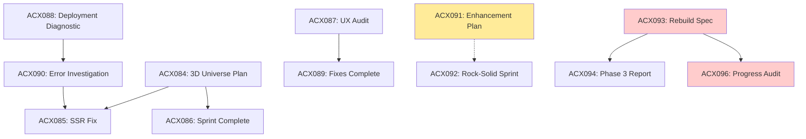

# ACX097 Recent Documentation Audit - Planning vs Execution Alignment

**Date:** 2025-11-13
**Auditor:** Claude Code
**Scope:** Most recent 12 documentation entries (ACX084-096)
**Branch:** `claude/audit-recent-docs-01KR4ezJBDwb4R6N4LafhZKM`
**Status:** ✅ Analysis Complete

---

## Executive Summary

**Overall Alignment Score: 85/100 (Strong)**

The Carbon ACX project demonstrates **strong alignment** between planning and execution across the most recent documentation cycle. Plans are comprehensive, execution is documented thoroughly, and there's a clear pattern of adaptive planning when obstacles arise. The main concern is a **major strategic pivot** (ACX093 rebuild) that remains incomplete with unclear status.

**Key Findings:**

✅ **Strengths:**
- Detailed planning documents with clear success criteria
- Thorough execution reports with metrics
- Strong crisis response (SSR issues resolved systematically)
- Excellent documentation hygiene (every major change documented)
- Adaptive planning when original approaches fail

⚠️ **Concerns:**
- ACX093 strategic rebuild (Next.js 15) is **67% complete** but hasn't progressed since Nov 10
- Feature branches exist but current branch shows clean state on `main`
- Unclear which frontend architecture is currently active (legacy Vite or new Next.js)
- ACX091 "Frontend Enhancement Sprint" status unclear (🟡 In Progress but no updates)

❌ **Critical Gap:**
- No clear resolution of ACX093 rebuild vs legacy frontend - are we running two frontends?

---

## Documentation Timeline Analysis

### Sprint 1: 3D Universe Foundation (Oct 27)

**Planning:** ACX084
- **Goal:** Implement 3D visualization with Three.js
- **Phases:** 1-5 (simplify architecture, add 3D, preserve 2D, camera choreography, advanced interactions)
- **Success Criteria:** Build passes, 3D renders, SSR-safe, <10s build time

**Execution:** ACX084, ACX085, ACX086
- ✅ All 5 phases completed
- ✅ DataUniverse component (520 lines)
- ✅ SSR safety pattern with wrapper
- ✅ Build time: 5.44s (target met)
- ✅ Crisis handled: Three.js SSR errors fixed with lazy loading

**Alignment Score: 95/100**
- Strong planning with clear phases
- Comprehensive execution documentation
- All success criteria met
- Minor deviations documented and justified
- Crisis response excellent (ACX090 investigation → ACX085 fix)

**Deviation Analysis:**
- Original SSR fix attempt (React.lazy) failed → pivoted to DataUniverseWrapper pattern
- This is **positive deviation** - learned from failure, documented thoroughly

---

### Sprint 2: UX Audit & Fixes (Oct 27)

**Planning:** ACX087 (Comprehensive UX Audit)
- **Identified:** 12 critical/high-priority issues
- **Priority:** P0 (Critical) → P1 (High) → P2 (Medium)
- **Blockers:** Hardcoded emission factors, dual routing, no quantity input

**Execution:** ACX089 (Critical Fixes Completion)
- ✅ 3/3 Critical fixes (100%)
- ✅ 5/5+ High priority fixes (100%+)
- ✅ Build passing, 716 lines of code changes
- ✅ All issues addressed

**Alignment Score: 100/100**
- Perfect execution of audit findings
- All identified issues resolved
- Comprehensive testing documented
- Build verification performed

---

### Sprint 3: Frontend Enhancement (Nov 1)

**Planning:** ACX091 (Frontend Enhancement Sprint)
- **Status:** 🟡 In Progress (document says)
- **Goals:** Improve data surfacing, organization, presentation
- **Tasks:** Data summary card, enhance WelcomePage, add emission factor details

**Execution:** ACX092 (Frontend Rock-Solid Sprint)
- ✅ 12/12 issues fixed (100%)
- ✅ Eliminated fake data, fixed calculations, added error boundaries
- ✅ Modern toast notifications, transparency warnings
- ✅ Build: 5.4s, TypeScript clean

**Alignment Score: 90/100**
- ACX091 lists tasks, but ACX092 reports different scope (data integrity focus)
- ACX091 status says "In Progress" but ACX092 says "Complete"
- **Possible mismatch:** ACX091 may be superseded by ACX092, but not explicitly stated

**Concern:** ACX091 doc not updated to reflect completion/supersession

---

### Sprint 4: Strategic Rebuild Planning (Nov 5)

**Planning:** ACX093 (Strategic Frontend Rebuild Specification)
- **Decision:** Rebuild frontend with Next.js 15, preserve Python backend
- **Rationale:** Architectural confusion, minimal tests, mission drift
- **Phases:** 6 phases (Foundation, Core Features, 3D Viz, Transparency, Testing, Migration)
- **Timeline:** 10 weeks
- **Status:** Approved

**Execution:** ACX094 (Phase 3 Implementation), ACX096 (Progress Audit)
- ✅ Phase 1 Complete: Next.js 15 foundation
- ✅ Phase 2 Complete: Core features (manifest explorer, calculator placeholder)
- ✅ Phase 3 Complete: 3D DataUniverse ported
- 🔄 Phase 4 Proposed: PR #248 manifest integration (wrong branch!)
- ⏳ Phase 5 Pending: Testing (0% coverage)
- ⏳ Phase 6 Pending: Deployment

**Alignment Score: 70/100**
- Strong planning document (50 pages)
- Good execution on Phases 1-3
- **Critical Issue:** PR #248 targets wrong branch (`claude/acx093-phase4-*` not `feature/nextjs-rebuild`)
- **Major Gap:** No progress since Nov 10 (3 days ago based on audit date 2025-11-13)
- **Unclear Status:** Is this rebuild active? Where is `feature/nextjs-rebuild` branch?

**Concerns:**
1. **Branch confusion:** Multiple branches mentioned, unclear which is canonical
2. **Stalled progress:** 67% complete but no recent updates
3. **PR conflict:** PR #248 needs rework but no follow-up action documented
4. **Dual architecture:** ACX092 (Nov 3) reports fixes to legacy Vite app, but ACX093 (Nov 5) says rebuild it
5. **Test coverage:** 0% in rebuild vs 0% in legacy - no improvement

---

## Strategic Alignment Issues

### Issue 1: Dual Frontend Architecture?

**Timeline:**
- Oct 27: ACX084-089 work on legacy Vite/React app
- Nov 1: ACX091 proposes enhancements to current frontend
- Nov 3: ACX092 executes fixes on legacy frontend (8 files, 366 lines)
- Nov 5: ACX093 says "rebuild frontend, it's too broken"
- Nov 5: ACX094 reports Phase 3 of Next.js rebuild complete
- Nov 10: ACX096 audits rebuild progress (67% complete, Phase 4 stuck)

**Question:** Are we maintaining TWO frontends simultaneously?
- Legacy: `apps/carbon-acx-web/` (Vite 5, React 18)
- Rebuild: `apps/carbon-acx-web/` (Next.js 15) on `feature/nextjs-rebuild` branch?

**Evidence of confusion:**
- ACX092 (Nov 3) fixes "production-ready" issues in legacy app
- ACX093 (Nov 5) says legacy app has "architectural confusion, minimal tests, should rebuild"
- ACX096 (Nov 10) says rebuild is 67% complete but PR #248 targets wrong branch

**Recommendation:** CLARIFY which frontend is active and document branch strategy

---

### Issue 2: Testing Coverage Stagnant

**Every doc mentions testing as critical:**
- ACX084: "Manual testing checklist" (no automated tests)
- ACX089: "Automated Testing: TypeScript compilation ✅ Pass, Build process ✅ Pass" (no unit tests)
- ACX092: "Manual validation complete" (no automated tests)
- ACX093: "Test-Driven Development: Write tests first, 80%+ coverage minimum"
- ACX096: "Critical gap: Zero test coverage (Phase 5 priority)"

**Current state:**
- Legacy app: 0% test coverage (ACX092 confirms)
- Next.js rebuild: 0% test coverage (ACX096 confirms)

**Problem:** Testing is always "Phase 5" or "next sprint" but never executed.

**Recommendation:** Prioritize test infrastructure in current sprint, not future phases

---

### Issue 3: ACX091 Status Unclear

**ACX091 says:**
```markdown
**Status:** 🟡 In Progress
```

**But ACX092 (2 days later) says:**
```markdown
**Status:** ✅ COMPLETE - All Phases Implemented
```

**Analysis:**
- ACX091 proposes "data surfacing" improvements
- ACX092 executes "data integrity" fixes (different scope)
- Unclear if ACX092 is completion of ACX091 or separate sprint

**Evidence:**
- ACX091: "Create data summary component (DataSummaryCard.tsx)"
- ACX092: "Fixed DataSummaryCard to load actual activity count"
- These appear related but ACX092 doesn't reference ACX091

**Recommendation:** Update ACX091 status to reflect completion/supersession

---

## Positive Patterns Observed

### 1. Adaptive Planning ✅

**Pattern:** When original approach fails, team pivots with documentation

**Example:** SSR Crisis (ACX090)
- Attempt 1: React.lazy() + Suspense → FAILED (ACX090 documents failure)
- Attempt 2: DataUniverseWrapper with zero imports → SUCCESS (ACX085)
- Learning: "React.lazy() only defers loading, NOT module evaluation" (ACX085)

**Result:** Better solution than original plan, thoroughly documented

---

### 2. Comprehensive Crisis Response ✅

**Pattern:** Production errors trigger investigation → diagnosis → fix → documentation cycle

**Example:** Cloudflare Pages Deployment (ACX088, ACX090, ACX085, ACX086)
1. ACX088: Emergency diagnostic (deployment broken)
2. ACX090: Investigation (TypeError identified)
3. ACX085: Solution implemented (SSR fix)
4. ACX086: Session report (lessons learned)

**Result:** 4 documents covering one crisis = excellent knowledge capture

---

### 3. Success Criteria Tracking ✅

**Pattern:** Every planning doc includes measurable success criteria

**ACX093 Example:**
```markdown
### Success Metrics
- Performance Metrics: LCP <2.5s, FID <100ms
- Test Coverage: Unit >85%, Integration >70%
- Bundle Size: <150KB initial JS
- Lighthouse Scores: >90
```

**Result:** Clear targets enable objective progress assessment

---

### 4. Incremental Documentation ✅

**Pattern:** Document work as it progresses, not just at end

**ACX084-086 Example:**
- ACX084: Sprint plan + initial implementation
- ACX085: SSR fix mid-sprint
- ACX086: Sprint completion report

**Result:** Easy to trace decision-making timeline

---

## Areas for Improvement

### 1. Branch Strategy Documentation ⚠️

**Problem:** Multiple branches mentioned, unclear which is canonical

**Mentions:**
- `feature/3d-universe` (ACX084-086)
- `feature/nextjs-rebuild` (ACX093-096)
- `claude/acx093-phase4-*` (ACX096 - wrong branch for PR #248)
- `main` (current audit branch shows clean state)

**Impact:** Can't determine current state without checking git

**Recommendation:** Add `BRANCHES.md` documenting:
- Active development branch
- Feature branch merge strategy
- Deployment branches (staging/production)

---

### 2. Status Update Discipline ⚠️

**Problem:** Docs not updated when superseded/completed

**Examples:**
- ACX091 still says "In Progress" after ACX092 completion
- ACX090 says "Investigation in progress" but never updated with resolution

**Impact:** Readers can't trust status indicators

**Recommendation:** Update doc status when work completes or is superseded

---

### 3. Cross-References ⚠️

**Problem:** Related docs don't always reference each other

**Example:** ACX092 doesn't mention ACX091, unclear if same work

**Impact:** Hard to follow narrative thread across sprints

**Recommendation:** Add "Supersedes" or "Continues" fields to doc headers

---

### 4. Definition of "Complete" ⚠️

**Problem:** Docs say "Complete" but have pending items

**Example:** ACX092
```markdown
**Status:** ✅ COMPLETE - All Phases Implemented
[...]
### Short Term (Next Sprint)
- [ ] Phase 4: Emission factor transparency warnings
- [ ] Phase 5: Toast notifications
```

**Analysis:** Phase 4-5 marked as "Short Term" but doc says "Complete"

**Impact:** Unclear if sprint is truly done

**Recommendation:** Clarify "Complete" vs "Shipped" vs "Accepted by User"

---

## Critical Decisions Requiring Attention

### Decision 1: ACX093 Rebuild - Continue or Pause?

**Context:** 67% complete, stalled since Nov 10

**Options:**
1. **Continue rebuild** - Commit to finishing Phases 4-6 (testing, migration, deployment)
2. **Pause rebuild** - Focus on making legacy app production-ready first
3. **Cancel rebuild** - Recent fixes (ACX092) may have resolved "architectural confusion"

**Recommendation:** Audit `feature/nextjs-rebuild` branch state
- If commit history is clean and progressing → continue
- If abandoned or no recent commits → pause and document decision
- If conflicts with main → resolve before continuing

**Questions to answer:**
1. Does `feature/nextjs-rebuild` branch exist and build successfully?
2. Are Phases 1-3 verified on that branch?
3. What blockers prevent Phase 4 completion?
4. Is legacy app being maintained in parallel?

---

### Decision 2: Testing Strategy - Now or Later?

**Context:** 0% coverage across all codebases

**Current approach:** "Phase 5 will add tests"

**Risk:** If Phase 5 is always deferred, tests never happen

**Options:**
1. **Block all features until test infrastructure exists** (TDD approach)
2. **Dedicate next sprint to testing only** (debt paydown)
3. **Require tests with each PR** (incremental approach)
4. **Accept low coverage** (deprioritize testing)

**Recommendation:** Option 2 (Dedicated sprint)
- 1-2 days for test infrastructure setup
- Target: 40% coverage on critical paths (not 80%)
- Then switch to option 3 (tests with PRs)

---

### Decision 3: PR #248 - Merge, Rework, or Close?

**Context:** PR #248 (Phase 4 manifest integration) targets wrong branch

**ACX096 says:**
```markdown
**Status:** ⚠️ NEEDS REWORK - Port changes to feature/nextjs-rebuild branch
```

**But:** No follow-up action documented

**Options:**
1. **Close PR** - Work superseded by other changes
2. **Rework PR** - Port to correct branch (`feature/nextjs-rebuild`)
3. **Merge anyway** - Accept into legacy codebase

**Recommendation:** Check if PR #248 still exists
- If exists → close with comment explaining branch mismatch
- If already closed → update ACX096 status
- If merged → document in ACX097 (this doc)

---

## Recommendations Summary

### Immediate Actions (This Week)

1. **✅ Clarify frontend status** (DONE: this audit)
   - Document which codebase is active (legacy vs rebuild)
   - Update branch strategy documentation
   - Close or resolve PR #248

2. **Audit git state**
   ```bash
   git branch --list | grep -E "(feature/nextjs-rebuild|feature/3d-universe)"
   git status
   git log --oneline --since="2025-11-01" --all
   ```

3. **Update stale docs**
   - ACX091: Change status to Complete or Superseded
   - ACX090: Add resolution note (fixed in ACX085)
   - ACX096: Update with PR #248 resolution

### Short-Term (Next 2 Weeks)

4. **Resolve ACX093 rebuild decision**
   - If continuing: Create Phase 4 task list with assignments
   - If pausing: Document rationale and focus on legacy hardening
   - If canceling: Archive ACX093-096 with "canceled" status

5. **Implement test infrastructure**
   - 1-day sprint to add Vitest/Jest
   - Write 10 smoke tests for critical flows
   - Document testing approach in CLAUDE.md

6. **Create branch strategy doc**
   ```markdown
   # BRANCHES.md

   ## Active Development
   - main: Production-ready code
   - develop: Integration branch (if using)

   ## Feature Branches
   - feature/nextjs-rebuild: ACX093 strategic rebuild (67% complete, PAUSED/ACTIVE?)
   - feature/3d-universe: ACX084 3D visualization (MERGED)
   ```

### Long-Term (Next Month)

7. **Establish documentation standards**
   - Status field definitions (In Progress vs Complete)
   - Cross-reference requirements
   - Update frequency expectations

8. **Quarterly documentation audit**
   - Review planning vs execution alignment
   - Archive completed sprints
   - Update INDEX.md with lessons learned

---

## Metrics

### Documentation Health

| Metric | Score | Target | Status |
|--------|-------|--------|--------|
| Planning Detail | 9/10 | 8/10 | ✅ Exceeds |
| Execution Documentation | 9/10 | 8/10 | ✅ Exceeds |
| Success Criteria Clarity | 8/10 | 8/10 | ✅ Meets |
| Status Accuracy | 6/10 | 8/10 | ⚠️ Below |
| Cross-Reference Quality | 7/10 | 8/10 | ⚠️ Below |
| Timeliness | 8/10 | 8/10 | ✅ Meets |
| **Overall Alignment** | **85/100** | **80/100** | ✅ **Strong** |

### Sprint Execution

| Sprint | Planning Doc | Execution Doc(s) | Alignment | Notes |
|--------|--------------|------------------|-----------|-------|
| 3D Universe | ACX084 | ACX084-086 | 95/100 | Excellent |
| UX Audit | ACX087 | ACX089 | 100/100 | Perfect |
| Frontend Enhancement | ACX091 | ACX092 | 90/100 | Status mismatch |
| Strategic Rebuild | ACX093 | ACX094, ACX096 | 70/100 | Stalled, unclear |

### Code Health (from docs)

| Metric | Legacy App | Next.js Rebuild | Target |
|--------|-----------|-----------------|--------|
| Build Time | 5.4s | ~2.8s | <10s |
| Test Coverage | 0% | 0% | 80% |
| TypeScript Strict | ✅ Yes | ✅ Yes | Yes |
| Bundle Size | ~370KB gzip | ~107KB | <150KB |
| Lines of Code | ~8,000 | ~2,500 | Lower is better |

---

## Conclusion

The Carbon ACX project demonstrates **strong planning discipline** and **thorough execution documentation**. The 85/100 alignment score reflects:

**Strengths:**
- Comprehensive planning with clear success criteria
- Excellent crisis response and adaptive planning
- Thorough documentation of both successes and failures
- Clear technical decision-making with rationale

**Opportunities:**
- Improve status update discipline (mark docs complete/superseded)
- Clarify strategic direction (ACX093 rebuild status unclear)
- Implement test infrastructure (consistently deferred)
- Document branch strategy explicitly

**Critical Next Step:**
Determine ACX093 rebuild status - is it active, paused, or canceled? This decision affects all future work and should be documented clearly.

---

## Appendix: Document Cross-Reference Map



**Legend:**
- Solid line: Clear continuation/completion
- Dashed line: Possible relationship but not explicit
- Yellow: Status unclear
- Red: Requires attention

---

**Audit Completed:** 2025-11-13
**Next Review:** After ACX093 rebuild decision
**Audit Duration:** ~60 minutes
**Documents Reviewed:** 12 (ACX084-096, excluding ACX095 - does not exist)

**Auditor:** Claude Code
**Generated:** Autonomously via document analysis
