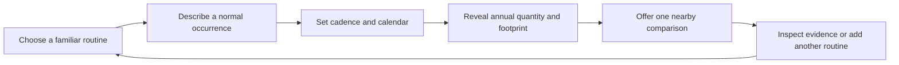

App Version: 2.0.0

# ACX110 — Glossary of Surfaces and Choice Points

## Purpose

This document provides a concise, indexed reference for every **frontend surface (panel)** and **user choice point** in the Carbon ACX web application. It is intended as a quick‑lookup guide for developers, designers, and reviewers who need to locate a specific UI area or the exact decision the user must make there.

---

## 1. Surfaces (frontend panels / pages)

| # | Panel / Surface | Path / Entry Point | Primary Function | Key Components |
|---|-----------------|--------------------|------------------|----------------|
| 1 | **Homepage (Editorial Landing)** | `/` | Introductory “jobs” section guiding users to the three core ways to engage: *Understand, Estimate, Inspect*. | `TraceEstimate`, three `<article>` cards, CTA links to `/methodology`, `/calculator`, `/explore` |
| 2 | **Header (Persistent Navbar)** | Top of every page | Site‑brand, primary navigation, theme toggle, mobile menu. | `Header.tsx` – links: Home, Calculator, Explore, Learn, Methodology; theme switcher; mobile nav |
| 3 | **Calculator Surface** | `/calculator` | Interactive annual‑worksheet builder; select activities, input quantities, see real‑time emissions results. | `CalculatorPage` – `CalculatorContent`, `CategoryTally`, `ActivityEditor`, `ResultPanel`, `EvidencePane` |
| 4 | **Learn Surface** | `/learn` | Curated case‑studies / learning cards that walk users through representative carbon‑estimate scenarios, with embedded calculator links. | `LearnPage` – `LearningCard`, CASE_STUDIES data, `SourceList`, worked‑emission calculations |
| 5 | **Explore Surface (Atlas)** | `/explore` | Browse the full activity catalogue with layered filtering (mode, category, region, publication status). Supports a tabular view and a detail pane per record. | `ExplorePage` – `AtlasFilters`, `AtlasTable`, `DetailPane`, `AtlasCoverageMap` |
| 6 | **3‑D Visualization Surface** | `/explore/3d` | Interactive WebGL globe that visualizes computed emissions by activity category and lets users select individual records. | `ThreeDVisualizationPage` – WebGL canvas, `DataUniverse` component, reduced‑motion handling |
| 7 | **Methodology Surface** | `/methodology` | Documented “published‑data contract”: primer example, benchmark definitions, source‑link evidence grid, and reference panels. | `MethodologyPage` – `Eyebrow`, primer card, `methodology‑grid`, multiple `reference‑panel` sections |
| 8 | **Manifests / Evidence Library Surface** | `/manifests` | Static‑file manifests (hash‑verified figures) that can be inspected or downloaded for audit purposes. | `ManifestsPage` – `Eyebrow`, manifest list cards with `figure_id`, `figure_path`, `hash_prefix` |
| 9 | **Footer (Persistent Reference Strip)** | Bottom of every page | Quick‑access navigation to core reference sections and the GitHub repository. | `Footer.tsx` – links: Methodology, Evidence library, Raw artifacts, Repository |
|10| **Learn Case‑Study Cards** (subset of Learn) | Within `/learn page` | Individual cards each representing a worked carbon‑estimate scenario (e.g., school run, home energy). | `LearningCard` component – fetches activity by ID, computes emissions, displays quantity, emissions, CTA |
|11| **Methodology Sub‑sections** (within `/methodology page`) | Within `/methodology page` | *Primer card* (single‑activity walkthrough), *Methodology grid* (macro overview), *Reference panels* (sources, citations, benchmarks), *Benchmarks* section. | Primer card, grid layout, reference‑panel blocks, benchmark options |
|12| **Explore Atlas Filters** (subset of Explore) | Within `/explore page` | Controls that narrow the catalogue: mode (personal/systems/industrial), category, region, publication status. | `AtlasFilters` – mode buttons, category dropdown, region selector, status toggles |
|13| **Explore Table View** (subset of Explore) | Within `/explore page` | Tabular display of filtered catalogue records with selectable rows that feed the `DetailPane`. | `AtlasTable` – renders rows of activity records, onSelect → `DetailPane` |
|14| **Detail Pane** (subset of Explore) | Within `/explore page` (and other surfaces) | Expands to show record‑level boundary, geography, vintage, uncertainty, source links for a selected catalogue activity. | `DetailPane` – displays evidence metadata, source citations, action buttons |
|15| **Result Panel** (subset of Calculator) | Within `/calculator page` | Shows total emissions, per‑activity breakdown, benchmark comparison, and download / export options. | `ResultPanel` – summary object, benchmarkKey, evidenceId display |
|16| **Evidence Pane** (subset of Calculator) | Within `/calculator page` | Modal / side panel that reveals the source‑trail for a given activity factor (factor ID, source IDs, citation URLs). | `EvidencePane` – activity prop, quantity, close handler; renders source list and citations |

---

## 2. Choice Points (user‑selected items from lists / toggles)

| # | Panel / Surface | UI element (code anchor) | Choice options presented | What the choice controls |
|---|-----------------|--------------------------|------------------------|--------------------------|
| 1 | **Homepage** | `TraceEstimate.tsx:37‑43` – annual-distance input | A positive annual distance | Sets the prefilled school-run estimate and the calculator continuation link. |
| 2 | **Homepage** | `app/page.tsx:14‑39` – three job-path links | Understand / Estimate / Inspect | Chooses the user’s initial route: Methodology, Calculator, or Atlas. |
| 3 | **Header** | `Header.tsx:25‑39` – primary nav and theme control | Five routes; Light / Dark | Changes route or global colour theme. These are utility choices, not part of the estimate narrative. |
| 4 | **Calculator** | `calculator/page.tsx:178‑193` – category rail | One `ActivityCategory` at a time | Sets `activeCategory`, which changes the visible activity shelf. |
| 5 | **Calculator** | `ActivityShelf.tsx` plus `calculator/page.tsx:111‑128` – add/remove activities | Any number of published activity records | Builds the worksheet list in `selectedIds`. |
| 6 | **Calculator** | `calculator/page.tsx:303‑315` – annual-quantity field | A positive quantity per selected activity | Sets each record’s calculated contribution. This is essential input, not a list choice. |
| 7 | **Calculator** | `calculator/page.tsx:383‑387` – comparison-basis select | Options from `getBenchmarkOptions()` | Changes the contextual comparison in `ResultPanel`; it does not alter the estimate. |
| 8 | **Calculator: AI research layer** | `ScenarioPane.tsx:99‑114` – AI-activity select | Documented AI activities | Determines which scenario records are eligible for the next select. |
| 9 | **Calculator: AI research layer** | `ScenarioPane.tsx:115‑130` – scenario select | Documented scenarios for the selected AI activity | Resolves the exact evidence record; only published scenarios contribute to the total. |
|10| **Calculator: AI research layer** | `ScenarioPane.tsx:131‑145` – scenario quantity | A positive annual quantity | Calculates the selected published AI scenario’s contribution. |
|11| **Explore (Atlas)** | `explore/page.tsx:48‑52` – catalogue-mode switch | Personal / household; Canadian systems; Industrial layers | Selects the catalogue layer and resets the three filters. |
|12| **Explore (Atlas)** | `explore/page.tsx:96‑100` – filter toolbar | Category, Region, and Publication selects | Narrows records inside the active mode. |
|13| **Explore (Atlas)** | `explore/page.tsx:64, 113` – coverage-map or table record selection | Any currently displayed record | Opens that record’s detail/evidence pane. |
|14| **Explore (Atlas)** | `explore/page.tsx:67‑70` – “Data table” disclosure | Show / hide the tabular representation | Reveals an alternative, accessible record-browsing surface; it does not change data. |
|15| **Learn** | `learn/page.tsx:15‑34, 119‑121` – three worked-example CTAs | Household school travel; small-office area; Canadian-system electricity | Opens the selected example in Calculator or Atlas. |
|16| **3‑D activity lab** | `explore/3d/page.tsx:72‑78, 96‑102` – sphere or “Inspect evidence” selection | Any result already present in the worksheet | Opens evidence for one calculated record. Reduced-motion is detected from system preference, not chosen in this UI. |

---

## 3. How to Use This Glossary

- **Locate a surface**: Find the row by its panel number or path; the “Key Components” column points to the exact React components that render that surface.
- **Identify a choice point**: Match the UI description (or the code‑anchor line number) to the exact state variable or prop being set; the “What the choice controls” column explains the downstream effect.
- **Cross‑panel impacts**: Changing a choice (e.g., mode in Explore, row 5) re‑computes memos (`records`, `filtered`) and re‑renders dependent UI (atlas table, 3‑D globe, result panel).
- **Design‑system consistency**: All category buttons share the `category-button` CSS rules (see `category-button` at line 770‑816); mode switches use the same `mode-switcher` pattern in Header and Explore.

---

## 4. Narrative Calculator Grammar and Visual Flow Strategy

### Objective

Carbon ACX should turn a familiar routine into a transparent annual estimate without asking the visitor to manufacture an annual aggregate or assemble an unexplained list of records. The annual total is the revealed consequence of a routine; the visible equation is the product’s explanation, audit trail, and invitation to compare.

This strategy has two equally important outcomes:

1. Preserve curiosity by making each result invite a nearby comparison or another routine.
2. Reduce cognitive and visual load: one coherent calculation, result, and continuation should fit in the first viewport. Full shelves, filters, technical disclosures, and secondary representations are intentional expansions.

Do not hide complexity. Show necessary complexity when it becomes meaningful.

### Canonical equation grammar

Every calculator line follows one shared grammar:

```text
Identity × per-occurrence extent × cadence × calendar
  = annual functional quantity × published factor
  = annual footprint
```

| Grammar role | User meaning | Examples |
|---|---|---|
| **Identity** | What routine, provider, mode, product, or meal applies? Resolves the exact evidence record. | Toronto subway; Instagram; meal with beef; provider + model/use case. |
| **Per-occurrence extent** | How much happens on a normal occasion? | 8 km/leg; 1.5 h/use day; 12 prompts/use day; 1 serving/meal. |
| **Cadence** | How often does the normal occasion happen? | 5 travel days/week; 4 use days/week; 12 use days/month. |
| **Calendar** | For how much of the year does the routine continue? | 48 weeks/year; 40 school weeks/year; 12 months/year. |
| **Annual functional quantity** | The factor-compatible annual quantity Carbon ACX derives. | 3,840 passenger-km/year; 312 h/year; 1,728 prompts/year. |
| **Published factor** | The evidence-backed conversion. | g CO₂e/passenger-km; g CO₂e/h; g CO₂e/prompt. |
| **Annual footprint** | The transparent annual screening estimate. | kg CO₂e/year. |

Canonical visual syntax:

```text
[Activity icon + identity] × [extent] × [cadence] × [calendar]
= [derived annual quantity] × [factor + evidence state]
= [annual footprint]
```

Every numeric term has a visible unit. User-authored values, visible defaults, and derived values are visually distinct. The renderer and the arithmetic must use the same derivation function: no explanatory equation may diverge from the calculation.

### Visual language and iconography

`ActivityMark.tsx` already supplies the correct identity vocabulary: category marks and specific Lucide marks for car, bicycle, subway, bus, aircraft, meals, streaming media, social use, AI, home systems, clothing, and devices. Use that vocabulary as the user’s navigational aid.

| Visual role | Rule |
|---|---|
| **Identity icon** | Put the record-specific `ActivityMark` at the beginning of every calculation line. Retain it in the picker, compact line summary, comparison, result composition, Atlas record, and evidence pane. |
| **Category colour** | Use existing category colour as a grouping accent, never as the sole carrier of meaning. Icon and text label remain present. |
| **Equation stages** | Use a consistent quiet mark or layout treatment for routine, occurrence, cadence, calendar, derived quantity, factor, and final result. Labels and units remain visible. |
| **Evidence state** | Place the existing published/unavailable badge beside the factor, not only at the end of a card. The user should know immediately whether a line may enter arithmetic. |
| **Comparison** | Use a paired activity icon or quiet directional mark for one compatible local alternative. This should invite the next calculation without reopening a broad catalogue. |

No decorative icon fields. Each icon must identify an activity, grammar stage, evidence state, or next action. Inaccessible colour- or icon-only meaning is prohibited.

### Viewport and disclosure policy

The first viewport prioritizes:

1. the current narrative prompt;
2. the active routine equation;
3. the live annual result;
4. one nearby comparison or continuation;
5. a compact summary of completed lines.

Everything else is progressive disclosure:

- Category rail and complete activity shelf → **Browse all activities**.
- Atlas category, region, and publication filters → **Narrow these results**.
- Atlas table → **View all records**.
- Benchmark selector → **Change comparison basis** in result context.
- Source citations, scope, geography, vintage, uncertainty, and raw scenario metadata → existing evidence action.
- 3-D activity lab → optional representation after an estimate, never a prerequisite path.

This is a layout requirement, not merely a copy rewrite. Visitors must not need to scroll to understand the current question, its derivation, and its result.

### Transport recipe: commute as a routine

Use **one-way distance** as the primary input because it matches maps and ordinary speech.

- **Leg**: travel in one direction.
- **Travel day**: one outbound leg and one return leg by default.
- **One-way distance**: origin to destination.
- **Return journey**: initially equal to the outbound journey and explicitly shown.

Primary sequence:

1. **How do you usually make this journey?** — mode cards with car, subway, bus, bicycle, and other supported record-specific marks.
2. **How far is it one way?** — kilometres per leg.
3. **Do you return the same way?** — default `Yes — 2 legs on a travel day`; expand **My return journey differs** only when needed.
4. **How many travel days in a typical week?**
5. **How much of the year does this routine apply?** — visible, editable profiles: most of the year, school term, or custom.

Example:

```text
[Subway icon] Toronto subway
× 8 km/leg
× 2 legs/travel day
× 5 travel days/week
× 48 weeks/year
= 3,840 passenger-km/year
× 4.76 g CO₂e/passenger-km [published]
= 18.3 kg CO₂e/year
```

The current transport records are represented as `km`, while their descriptions identify passenger kilometres; the car record additionally defaults passengers to one when unspecified. A recipe must render the factor basis and any applied occupancy assumption. Vehicle-km and passenger-km must never be silently conflated.

### Recipes across activity classes

The grammar is stable; the natural language follows the factor-compatible unit.

| Class | Human-scale derivation | Constraint |
|---|---|---|
| **Digital services** | Service × hours/use day × use days/week × weeks/year = hours/year. | Use only when the published factor is time-compatible. |
| **AI / LLMs** | Provider + model/use case × prompts or responses/use day × use days/month × months/year = prompts or responses/year. | Provider and use case resolve evidence; they are not numeric multipliers. |
| **Meals** | Meal type × servings/meal × meals/week × weeks/year = servings/year. | Preserve serving definition and factor boundary. |
| **Home / utilities** | Utility × amount/billing cycle × billing cycles/year = annual unit; or operating hours/use day × use days/week × active weeks/year. | Use the cadence a household actually encounters. |
| **Purchases** | Product × items/purchase × purchases/month × months/year = items/year. | Do not infer a purchase frequency. |

Current AI evidence records use `prompt` or `response`, not `hour`, functional units. An hours/day AI input is valid only with an explicit conversion bridge:

```text
hours/use day × prompts/hour = prompts/use day
```

The bridge must be source-backed or visibly user-authored. It must not silently enter published arithmetic.

### Multi-line worksheet behaviour

Narrative flow applies to each line, not only to a single-path wizard. Users must continue to add multiple records in the same class: several commute modes or routes, social services, AI providers/models/use cases, meals, home systems, and purchases.

Required behaviour:

1. Completing a line collapses it into a compact equation card: icon, identity, derived annual quantity, annual footprint, and evidence state.
2. Only the active line presents the expanded narrative form.
3. Continuations are class-specific: **Add another way you travel**, **Add another digital service**, **Add another AI use**, or **Add another meal pattern**.
4. Each continuation initially offers a small relevant set plus **Browse all activities**; it does not reopen the whole category rail by default.
5. Lines retain independent inputs, evidence, factor units, and result values even when grouped under the same category colour.
6. Users can edit, remove, duplicate, inspect, and compare each line independently.
7. Category and all-lines totals remain compact summaries; they do not replace line-level narratives.

```text
Your routines                                      2.1 t CO₂e/year
────────────────────────────────────────────────────────────────
[Subway]    8 km × 5 days/week × 48 weeks       18.3 kg   Published
[Instagram] 1.5 h × 4 days/week × 52 weeks      …         Published
[AI]        12 prompts × 12 days/month          …         Published

+ Add another digital service     + Add another way you travel
Browse all activities
```

### Consolidated choice flow

| Current cluster | Narrative treatment | Secondary expansion |
|---|---|---|
| Home: Understand / Estimate / Inspect | Start with a familiar routine. | Primary navigation remains available as utility navigation. |
| Category → activity shelf → basket | Complete one routine before inviting another. | Browse all activities. |
| Annual aggregate field | Ask extent, cadence, and calendar; derive annual quantity live. | Direct editing only if every assumption remains visible. |
| Benchmark selector | Show the default comparison after a result. | Change comparison basis. |
| AI activity → scenario → quantity | Start with provider/service and use case; resolve automatically only when exactly one valid evidence record exists. | Scenario selection appears only for genuine documented ambiguity. |
| Atlas mode + filters | One question: Which layer do you want to inspect? | Narrow these results. |
| Map versus table | Coverage view introduces the landscape. | View all records. |
| Parallel Learn examples | One guided example with the next lesson. | Browse all examples. |

### Curiosity and comparison loop



Comparison order:

1. Local counterfactual: the same journey by another supported mode, another documented meal, a changed cadence, or a comparable documented workload.
2. Category composition: relation to the user’s other active lines.
3. External benchmark: regional, national, or other context only after the user understands their own routine.

Comparisons must remain source-compatible; Carbon ACX must not compare incompatible units or manufacture an equivalent scenario.

### Invariants and redesign acceptance criteria

- Published-only arithmetic, unavailable-state handling, and the existing policy excluding estimate-status AI scenarios from totals remain unchanged.
- Every result retains factor ID, boundary, region, GWP horizon, vintage, source IDs, and publication state.
- Every full equation remains available as text without dependence on colour, icon, hover, canvas, or WebGL.
- Keyboard users can complete, expand, edit, remove, inspect, and compare lines without drag or hover.
- Reduced-motion and non-WebGL paths retain full calculation and evidence access.
- A first-time visitor can complete one familiar routine without entering an annual aggregate.
- The first viewport includes prompt, derivation, result, and one next action.
- Multiple lines in the same activity class remain supported without returning the user to a full catalogue by default.

### Implementation direction

Start with a transport routine recipe. It exercises icon identity, one-way/return semantics, cadence, calendar assumptions, passenger-kilometre basis, live derivation, local comparison, and multiple-line behaviour. Then apply the recipe to digital, AI, meals, home, and purchases only where the factor unit supports a lossless, visible derivation.

*Compiled on 2026‑08‑24 for the Carbon ACX repository. This file follows the workspace documentation naming convention `ACX### Glossary of ….md` and is stored under `docs/acx/`.*