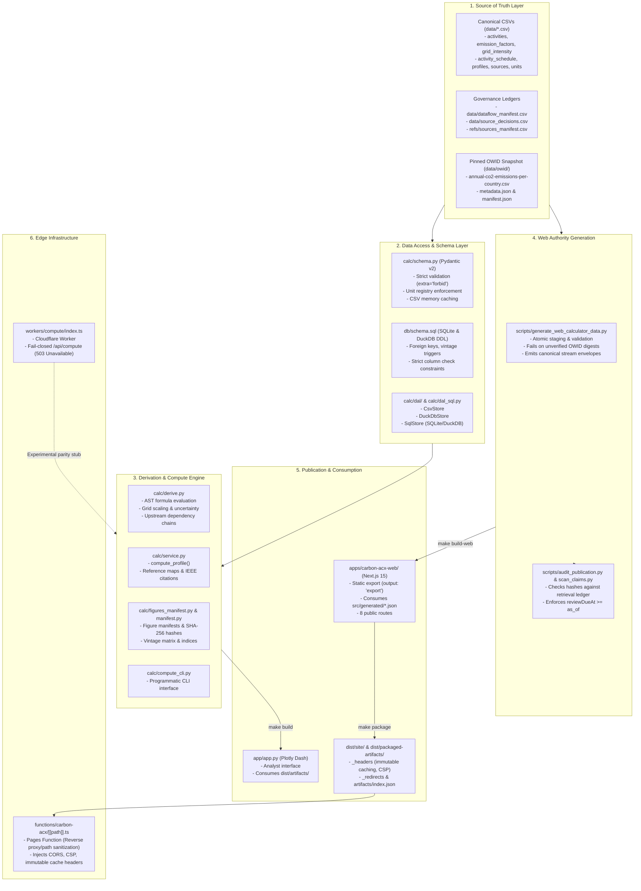

---
related:
  - ACX066
  - ACX108
  - ACX109
  - ACX111
---

# ACX115 Backend Architectural Audit and Dataflow Topology

**Status:** Approved  
**Date:** 2026-09-04  
**Author:** Assistant  
**Repository:** `carbon-acx`  
**Tags:** #backend #architecture #cloudflare #python #sqlite #dataflow #provenance

---

## 1. Executive Summary

Carbon ACX is an open-source carbon-accounting and civic-literacy stack designed around **immutable provenance**, **cryptographic data hashes**, and **fail-closed verification**.

Unlike traditional web applications featuring a continuous dynamic REST/GraphQL API connected to a live production database, Carbon ACX operates an **offline-first, build-time derivation and static packaging architecture**:
1. **Source of Truth:** Canonical version-controlled CSV files and pinned snapshots under `data/`.
2. **Derivation Engine:** A Python computation and validation engine (`calc/`) implementing schema validation (Pydantic), data access abstraction (CSV, DuckDB, SQLite), mathematical emission modeling, and cryptographic figure/manifest generation.
3. **Public Product Authority Generator:** Staged, atomic build scripts (`scripts/generate_web_calculator_data.py`) emitting versioned JSON contracts with bound SHA-256 digests into both public distribution paths and static TypeScript compilation sources.
4. **Delivery & Edge Routing:** Cloudflare Pages delivering static Next.js 15 export bundles and immutable `/artifacts/` with browser-side Web Crypto verification, assisted by Cloudflare Pages Functions (`functions/carbon-acx/[[path]].ts`) for path sanitization and reverse proxying, alongside a fail-closed experimental Worker (`workers/compute/`).
5. **Analyst Surface:** A dedicated local Dash analytics server (`app/`) reading derived artifact figures directly.

---

## 2. Layered Architecture & Component Topology

---

## 3. Deep Dive: Subsystems & Execution Models

### 3.1. Data Layer & Data Access (DAL)
The repository supports three interchangeable storage/retrieval engines conforming to the `DataStore` protocol defined in `calc/dal/__init__.py`:
- **`CsvStore` (`calc/dal/csv.py`):** Direct read-through of CSV files via `pandas.read_csv`. Includes in-memory caching keyed by file modification timestamps (`mtime_ns`) in `calc/schema.py`.
- **`DuckDbStore` (`calc/dal/duckdb.py`):** In-memory DuckDB engine executing parameterized `read_csv` SQL queries with explicit `VARCHAR` types, full sampling (`SAMPLE_SIZE = -1`), and null-padding.
- **`SqlStore` (`calc/dal_sql.py`):** SQLite (or persistent DuckDB) store initialized from `db/schema.sql`. Used for indexed lookups, relational validation, and performance tests.

**Integrity Controls:**
- `db/schema.sql` enforces relational consistency with `PRAGMA foreign_keys = ON;`, strict ISO-formatted region check constraints (`CA`, `CA-XX`), uncertainty bounds (`low <= high`), and SQLite triggers (`sources_year_check_insert`, `emission_factors_vintage_check_insert`) preventing vintages beyond `strftime('%Y', 'now')`.
- `calc/schema.py` models use Pydantic v2 with `extra="forbid"`, validating units against `data/units.csv` and cross-validating references between activities, layers, and functional units.

### 3.2. Derivation & Compute Pipeline (`calc/derive.py` & `calc/service.py`)
- **AST Formula Evaluation:** `calc/derive.py` uses Python's standard `ast` module to safely parse and evaluate functional unit conversions without `eval()`. It restricts syntax strictly to binary math operators (`+`, `-`, `*`, `/`), unary signs, constants, and validated snake_case variable names.
- **Grid Intensity Scaling:** Activities marked `is_grid_indexed = 1` dynamically resolve electrical grid factors by region preference:
  $$\text{Emissions} = \text{Quantity} \times \text{Grid Intensity} (\text{g/kWh}) \times \text{Electricity} (\text{kWh/unit})$$
  Evaluates mean, low, and high uncertainty bounds.
- **Upstream Dependencies:** Traces supply-chain dependencies across operations, sites, and entities to construct full lifecycle footprint trees.
- **Canonical Slices & IEEE Citations:** Generates figure datasets for `stacked`, `bubble`, `sankey`, and `feedback` loop diagrams. Each slice cross-indexes data points to numbered IEEE reference strings formatted from source metadata.

### 3.3. Web Authority Generation (`scripts/generate_web_calculator_data.py`)
The generation pipeline turns raw CSVs and offline data into seven canonical JSON authorities:
1. `acx.web-calculator/1-6-0` (`calculator-data.json`): Curated activities, factors, and Canadian territorial benchmarks.
2. `acx.web-catalog/1-0-0` (`catalog-data.json`): Complete activity catalog and AI inference scenarios.
3. `acx.ai-scenarios/1-1-0`: Source-backed AI usage benchmarks.
4. `acx.web-sources/1-1-0` (`sources.json`): Master bibliography and retrieval metadata.
5. `acx.stream-catalog/1-0-0` (`stream-catalog.json`): Dataflow stream inventory from `data/dataflow_manifest.csv`.
6. `acx.owid-context/1-1-0` (`owid-context.json`): Pinned Our World in Data national carbon context.
7. `acx.public-release/1-1-0` (`release.json` / `release-data.json`): Cryptographic ledger binding SHA-256 digests of all source inputs and generated bytes.

**Transactional Guarantee:** Authorities are written first to a staging directory, audited, and atomically swapped into `apps/carbon-acx-web/src/generated/` and `apps/carbon-acx-web/public/data/`. Incomplete or unverified records remain explicitly `null` or `unavailable` rather than coerced to zero.

### 3.4. Edge & Serverless Architecture
- **Cloudflare Pages Static Export:** The web app (`apps/carbon-acx-web`) is configured with `output: 'export'`. All pages are pre-rendered at build time. No dynamic Node.js server runs in production.
- **Pages Functions (`functions/carbon-acx/[[path]].ts`):** Intercepts requests under `/carbon-acx/` or `/artifacts/`.
  - Sanitizes paths against traversal attacks (`sanitiseArtifactKey`).
  - Sets immutable caching headers (`Cache-Control: public, max-age=31536000, immutable`) for artifacts.
  - Reverse proxies to `CARBON_ACX_ORIGIN` if configured, falling back to static generation.
- **Cloudflare Worker Compute (`workers/compute/index.ts`):**
  - Configured via `wrangler.toml` (`main = "workers/compute/index.ts"`, compatibility date `2024-05-01`).
  - Currently implemented as an intentional **fail-closed endpoint**: `/api/compute` returns HTTP 503 (`unavailable`) because live edge computation provenance has not been verified against the canonical Python contract (`calc/service.py`).
  - Health check `/api/health` reports `{ ok: true, compute: "unavailable" }`.

---

## 4. Key Architectural Contracts & Invariants

| Contract Area | Invariant / Enforcement Mechanism |
|---|---|
| **Data Integrity** | Fail-closed: missing data is represented as `null`/`unavailable`, never fabricated or coerced to 0. |
| **Provenance** | Every calculation references a published source ID with an immutable SHA-256 in `refs/sources_manifest.csv` and an approved decision in `data/source_decisions.csv`. |
| **Audit Requirement** | `make data-audit` and `scripts/audit_publication.py` verify that `reviewDueAt >= AUDIT_AS_OF` and hashes match byte-for-byte. |
| **Zero Runtime Mutation** | Production is entirely static. Cloudflare Pages serves immutable pre-calculated assets and JSON authorities. |
| **Strict Type Boundaries** | Python Pydantic models forbid undeclared fields (`extra="forbid"`). Next.js uses strict TypeScript and Next typegen. |
| **Security at Edge** | Pages Functions and Pages `_headers` enforce strict CSP (`frame-ancestors 'none'`, `object-src 'none'`), HSTS, nosniff, and granular CORS. |

---

## 5. Architectural Recommendations & Future Directions

1. **Parity Testing for Edge Compute:** If dynamic on-demand compute is ever activated in `workers/compute/`, write cross-runtime test suites that execute identical inputs through `calc/compute_cli.py` and the Worker via Miniflare/Wrangler, asserting matching SHA-256 JSON responses.
2. **Consolidation of Artifact Paths:** Currently, figures in `dist/artifacts/` maintain both hashed filenames and stable aliases (`stacked.json` vs. `<hash>.json`) to satisfy both Dash and static manifests. Migrating Dash to consume manifest indices directly would eliminate redundant files.
3. **Automated Schema Sync:** Ensure SQLite DDL in `db/schema.sql` and Pydantic models in `calc/schema.py` are continuously checked for schema drift via `tests/test_schema_sql.py`.
