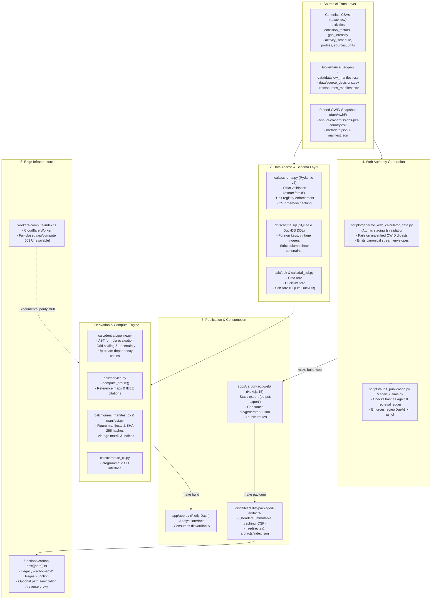

---
related:
  - ACX066
  - ACX108
  - ACX109
  - ACX111
---

# ACX115 Backend Architectural Audit and Dataflow Topology

**Status:** Approved  
**Date:** 2026-09-04  
**Author:** Assistant  
**Repository:** `carbon-acx`  
**Tags:** #backend #architecture #cloudflare #python #sqlite #dataflow #provenance

---

## 1. Executive Summary

Carbon ACX is an open-source carbon-accounting and civic-literacy stack designed around **immutable provenance**, **cryptographic data hashes**, and **fail-closed verification**.

Unlike traditional web applications featuring a continuous dynamic REST/GraphQL API connected to a live production database, Carbon ACX operates an **offline-first, build-time derivation and static packaging architecture**:
1. **Source of Truth:** Canonical version-controlled CSV files and pinned snapshots under `data/`.
2. **Derivation Engine:** A Python computation and validation engine (`calc/`) implementing schema validation (Pydantic), data access abstraction (CSV, DuckDB, SQLite), mathematical emission modeling, and cryptographic figure/manifest generation.
3. **Public Product Authority Generator:** Staged, atomic build scripts (`scripts/generate_web_calculator_data.py`) emitting versioned JSON contracts with bound SHA-256 digests into both public distribution paths and static TypeScript compilation sources.
4. **Delivery & Edge Routing:** Cloudflare Pages is intended to deliver the static Next.js 15 export and immutable `/artifacts/` with browser-side Web Crypto verification. The repository also contains a legacy `/carbon-acx/*` Pages Function and a fail-closed experimental Worker (`workers/compute/`); neither is currently a CI-deployed production contract.
5. **Analyst Surface:** A dedicated local Dash analytics server (`app/`) reading derived artifact figures directly.

---

## 2. Layered Architecture & Component Topology

```mermaid
flowchart TD
    subgraph SOT [1. Source of Truth Layer]
        CSV["Canonical CSVs (data/*.csv)\n- activities, emission_factors, grid_intensity\n- activity_schedule, profiles, sources, units"]
        LEDGER["Governance Ledgers\n- data/dataflow_manifest.csv\n- data/source_decisions.csv\n- refs/sources_manifest.csv"]
        OWID["Pinned OWID Snapshot (data/owid/)\n- annual-co2-emissions-per-country.csv\n- metadata.json & manifest.json"]
    end

    subgraph DAL [2. Data Access & Schema Layer]
        PYDANTIC["calc/schema.py (Pydantic v2)\n- Strict validation (extra='forbid')\n- Unit registry enforcement\n- CSV memory caching"]
        SQL_SCHEMA["db/schema.sql (SQLite & DuckDB DDL)\n- Foreign keys, vintage triggers\n- Strict column check constraints"]
        STORES["calc/dal/ & calc/dal_sql.py\n- CsvStore\n- DuckDbStore\n- SqlStore (SQLite/DuckDB)"]
    end

    subgraph ENGINE [3. Derivation & Compute Engine]
        DERIVE["calc/derive/pipeline.py\n- AST formula evaluation\n- Grid scaling & uncertainty\n- Upstream dependency chains"]
        SERVICE["calc/service.py\n- compute_profile()\n- Reference maps & IEEE citations"]
        MANIFEST["calc/figures_manifest.py & manifest.py\n- Figure manifests & SHA-256 hashes\n- Vintage matrix & indices"]
        CLI["calc/compute_cli.py\n- Programmatic CLI interface"]
    end

    subgraph GENERATORS [4. Web Authority Generation]
        GEN_SCRIPT["scripts/generate_web_calculator_data.py\n- Atomic staging & validation\n- Fails on unverified OWID digests\n- Emits canonical stream envelopes"]
        AUDIT_SCRIPT["scripts/audit_publication.py & scan_claims.py\n- Checks hashes against retrieval ledger\n- Enforces reviewDueAt >= as_of"]
    end

    subgraph CONSUMERS [5. Publication & Consumption]
        DASH["app/app.py (Plotly Dash)\n- Analyst interface\n- Consumes dist/artifacts/"]
        NEXTJS["apps/carbon-acx-web/ (Next.js 15)\n- Static export (output: 'export')\n- Consumes src/generated/*.json\n- 8 public routes"]
        PAGES_BUNDLE["dist/site/ & dist/packaged-artifacts/\n- _headers (immutable caching, CSP)\n- _redirects & artifacts/index.json"]
    end

    subgraph EDGE [6. Edge Infrastructure]
        CF_FUNCTIONS["functions/carbon-acx/[[path]].ts\n- Legacy /carbon-acx/* Pages Function\n- Optional path sanitization / reverse proxy"]
        CF_WORKER["workers/compute/index.ts\n- Cloudflare Worker\n- Fail-closed /api/compute (503 Unavailable)"]
    end

    SOT --> DAL
    DAL --> ENGINE
    ENGINE -->|make build| DASH
    SOT --> GENERATORS
    GENERATORS -->|make build-web| NEXTJS
    GENERATORS --> AUDIT_SCRIPT
    NEXTJS -->|make package| PAGES_BUNDLE
    PAGES_BUNDLE --> CF_FUNCTIONS
    CF_WORKER -.->|Experimental parity stub| ENGINE
```

---

## 3. Deep Dive: Subsystems & Execution Models

### 3.1. Data Layer & Data Access (DAL)
The repository supports three interchangeable storage/retrieval engines conforming to the `DataStore` protocol defined in `calc/dal/__init__.py`:
- **`CsvStore` (`calc/dal/csv.py`):** Direct read-through of CSV files via `pandas.read_csv`. Includes in-memory caching keyed by file modification timestamps (`mtime_ns`) in `calc/schema.py`.
- **`DuckDbStore` (`calc/dal/duckdb.py`):** In-memory DuckDB engine executing parameterized `read_csv` SQL queries with explicit `VARCHAR` types, full sampling (`SAMPLE_SIZE = -1`), and null-padding.
- **`SqlStore` (`calc/dal_sql.py`):** SQLite (or persistent DuckDB) store initialized from `db/schema.sql`. Used for indexed lookups, relational validation, and performance tests.

**Integrity Controls:**
- `db/schema.sql` enforces relational consistency with `PRAGMA foreign_keys = ON;`, strict ISO-formatted region check constraints (`CA`, `CA-XX`), uncertainty bounds (`low <= high`), and SQLite triggers (`sources_year_check_insert`, `emission_factors_vintage_check_insert`) preventing vintages beyond `strftime('%Y', 'now')`.
- `calc/schema.py` models use Pydantic v2 with `extra="forbid"`, validating units against `data/units.csv` and cross-validating references between activities, layers, and functional units.

### 3.2. Derivation & Compute Pipeline (`calc/derive/` & `calc/service.py`)
- **AST Formula Evaluation:** `calc/derive/formulas.py` uses Python's standard `ast` module to safely parse and evaluate functional unit conversions without `eval()`. It restricts syntax strictly to binary math operators (`+`, `-`, `*`, `/`), unary signs, constants, and validated snake_case variable names.
- **Grid Intensity Scaling:** Activities marked `is_grid_indexed = 1` dynamically resolve electrical grid factors by region preference:
  $$\text{Emissions} = \text{Quantity} \times \text{Grid Intensity} (\text{g/kWh}) \times \text{Electricity} (\text{kWh/unit})$$
  Evaluates mean, low, and high uncertainty bounds.
- **Upstream Dependencies:** Traces supply-chain dependencies across operations, sites, and entities to construct full lifecycle footprint trees.
- **Canonical Slices & IEEE Citations:** Generates figure datasets for `stacked`, `bubble`, `sankey`, and `feedback` loop diagrams. Each slice cross-indexes data points to numbered IEEE reference strings formatted from source metadata.

### 3.3. Web Authority Generation (`scripts/generate_web_calculator_data.py`)
The generation pipeline turns raw CSVs and offline data into seven canonical JSON authorities:
1. `acx.web-calculator/1-6-0` (`calculator-data.json`): Curated activities, factors, and Canadian territorial benchmarks.
2. `acx.web-catalog/1-0-0` (`catalog-data.json`): Complete activity catalog and AI inference scenarios.
3. `acx.ai-scenarios/1-1-0`: Source-backed AI usage benchmarks.
4. `acx.web-sources/1-1-0` (`sources.json`): Master bibliography and retrieval metadata.
5. `acx.stream-catalog/1-0-0` (`stream-catalog.json`): Dataflow stream inventory from `data/dataflow_manifest.csv`.
6. `acx.owid-context/1-1-0` (`owid-context.json`): Pinned Our World in Data national carbon context.
7. `acx.public-release/1-1-0` (`release.json` / `release-data.json`): Cryptographic ledger binding SHA-256 digests of all source inputs and generated bytes.

**Transactional Guarantee:** Authorities are written first to a staging directory, audited, and atomically swapped into `apps/carbon-acx-web/src/generated/` and `apps/carbon-acx-web/public/data/`. Incomplete or unverified records remain explicitly `null` or `unavailable` rather than coerced to zero.

### 3.4. Edge & Serverless Architecture
- **Cloudflare Pages Static Export:** The web app (`apps/carbon-acx-web`) is configured with `output: 'export'`. All pages are pre-rendered at build time. No dynamic Node.js server runs in production.
- **Legacy Pages Function (`functions/carbon-acx/[[path]].ts`):** The checked-in function is scoped to `/carbon-acx/*`, not the root `/artifacts/` routes consumed by the web app. It sanitizes artifact keys, applies artifact headers, and optionally reverse-proxies when `CARBON_ACX_ORIGIN` is configured; current production routing depends on the packaged `_headers` bundle.
- **Cloudflare Worker Compute (`workers/compute/index.ts`):**
  - Configured via `wrangler.toml` (`main = "workers/compute/index.ts"`, compatibility date `2024-05-01`).
  - Currently implemented as an intentional **fail-closed endpoint**: `/api/compute` returns HTTP 503 (`unavailable`) because live edge computation provenance has not been verified against the canonical Python contract (`calc/service.py`).
  - Health check `/api/health` reports `{ ok: true, compute: "unavailable" }`.

---

## 4. Key Architectural Contracts & Invariants

| Contract Area | Invariant / Enforcement Mechanism |
|---|---|
| **Data Integrity** | Fail-closed: missing data is represented as `null`/`unavailable`, never fabricated or coerced to 0. |
| **Provenance** | Every calculation references a published source ID with an immutable SHA-256 in `refs/sources_manifest.csv` and an approved decision in `data/source_decisions.csv`. |
| **Audit Requirement** | `make data-audit` and `scripts/audit_publication.py` verify that `reviewDueAt >= AUDIT_AS_OF` and hashes match byte-for-byte. |
| **Zero Runtime Mutation** | Production is entirely static. Cloudflare Pages serves immutable pre-calculated assets and JSON authorities. |
| **Strict Type Boundaries** | Python Pydantic models forbid undeclared fields (`extra="forbid"`). Next.js uses strict TypeScript and Next typegen. |
| **Security at Edge** | Pages Functions and Pages `_headers` enforce strict CSP (`frame-ancestors 'none'`, `object-src 'none'`), HSTS, nosniff, and granular CORS. |

---

## 5. Architectural Recommendations & Future Directions

1. **Parity Testing for Edge Compute:** If dynamic on-demand compute is ever activated in `workers/compute/`, write cross-runtime test suites that execute identical inputs through `calc/compute_cli.py` and the Worker via Miniflare/Wrangler, asserting matching SHA-256 JSON responses.
2. **Consolidation of Artifact Paths:** Currently, figures in `dist/artifacts/` maintain both hashed filenames and stable aliases (`stacked.json` vs. `<hash>.json`) to satisfy both Dash and static manifests. Migrating Dash to consume manifest indices directly would eliminate redundant files.
3. **Automated Schema Sync:** Ensure SQLite DDL in `db/schema.sql` and Pydantic models in `calc/schema.py` are continuously checked for schema drift via `tests/test_schema_sql.py`.

## 6. Post-ACX110 integration review (2026-09-25)

The ACX110 health pass is now integrated into `main`. This review separates the repository's
strong offline-first controls from the work still required before treating the backend as a
professional, repeatable release surface.

### 6.1 P0 — make the deployable artifact one contract

`make package` is the only target that assembles the static site, packaged artifacts, cache
headers, and inventory under `dist/site` (`Makefile:92-96`). The Cloudflare configuration still
points Pages at `pnpm build:web` and `apps/carbon-acx-web/dist` (`wrangler.toml:8-11`), while
`CLOUDFLARE_PAGES_CONFIG.md` repeats that older path and still names a historical
`feature/3d-universe` branch. A deployment can therefore pass the web build while omitting the
artifact and security-header bundle.

**Decision:** choose `dist/site` as the sole Pages output, make CI publish that exact directory,
and update the dashboard contract and deployment guide together. Do not maintain two valid build
paths.

**Release blocker:** `.github/workflows/release.yml:19-28` invokes the pinned-toolchain check
without first setting up Node or pnpm, while `scripts/bootstrap.sh:5-8,70-78` requires both.
The tag-triggered release path therefore cannot be relied on. Add the same Node/pnpm setup
used by CI before the check, then exercise a disposable release tag.

### 6.2 P1 — one dataset snapshot and one factor-selection policy

`calc/service.py:316-399` loads through the selected `DataStore` but silently falls back to CSV
loaders after empty results and broad exceptions. Factor selection is not one policy: the
service's dictionary construction keeps the last row (`calc/service.py:384-386`), the
derivation pipeline keeps the first row (`calc/derive/pipeline.py:129-137`), and the web
authority generator applies region preference and newest vintage
(`scripts/generate_web_calculator_data.py:212-223`). The same CSV inputs can therefore produce
different analyst and published values.

**Decision:** introduce one immutable dataset snapshot/repository with explicit optional-table
semantics, remove exception-swallowing backend fallback, and define one tested factor-resolution
policy used by every producer. Record the selected factor ID in every derived output.

### 6.3 P1 — make backend purpose explicit

`calc/service.py:303-309` exposes a useful local `compute_profile()` contract, but
`workers/compute/index.ts:52-65` intentionally returns an unavailable 503. This is a sound
fail-closed posture, not a production compute service. Either remove the Worker from the product
surface or implement a versioned edge contract with cross-runtime parity tests; do not leave
operators to infer which backend is authoritative.

### 6.4 P1 — strengthen backend content, not just provenance plumbing

The source and decision ledgers are strong release controls, but the content model still lacks a
first-class factor-quality classification. Numeric rows can be synthesized or derived while
sharing the same `published` status and nullable uncertainty fields (`data/emission_factors.csv:2-33`).
Add an explicit evidence type, data-quality grade, applicability boundary, and reason for missing
uncertainty. For every factor, retain a claim-level locator (table/page/row or quoted passage),
not only a source ID and broad landing-page URL (`data/sources.csv:1-4`,
`scripts/audit_publication.py:98-134`).

Keep the current fail-closed unavailable policy. Estimates and unavailable records must remain
outside totals, and regular activity records should expose their bounds or an explicit
`not quantified` state to consumers.

The SQL round-trip is not yet a byte-faithful authority migration. `make db_export` writes
directly into `./data` (`Makefile:138-139`), while `scripts/export_db_to_csv.py:22-37` omits
the `sectors` table and the import path canonicalizes `GLOBAL` to null and integer-cast years
(`scripts/import_csv_to_db.py:150-171`). Treat database export as a derived diagnostic until a
round-trip fixture covers every canonical table and representation.

### 6.5 P2 — close contract and operations gaps

- `tests/test_schema_sql.py:26-205` proves SQLite constraints but does not prove that the DDL and
  Pydantic models have the same columns, types, nullability, and enums. Add a schema-drift gate.
- `calc/schema.py:24-54` performs import-time reads of `data/units.csv` and caches by mtime. Make
  the data root explicit at the application boundary and pass a validated snapshot into services.
- CI already runs build, provenance, tests, edge containment, and E2E (`.github/workflows/ci.yml:26-198`).
  Add release smoke checks against the exact `dist/site` output, including `_headers`, inventory,
  artifact download, and a deployed health check. Keep the Worker fail-closed until its contract
  is implemented.
- The dependency audit workflow invokes npm against a pnpm lockfile and suppresses scanner
  failures (`.github/workflows/dep-audit.yml:77-86,127-149`). Use the pinned pnpm lock with a
  fail-closed audit command, and make scanner/network errors visible.
- Release validation builds data artifacts but does not build or smoke-test the web bundle
  (`.github/workflows/release.yml:36-52`). Release the same `dist/site` artifact that Pages
  serves, or explicitly document that releases are data-only.
- CORS policy differs between the Pages Function (`functions/carbon-acx/[[path]].ts:1-7`) and
  the packaged `_headers` template (`scripts/prepare_pages_bundle.py:10-29`). Define one
  intentional public/private origin policy and test it at the edge.
- Replace the stale Pages guide and add one operator-owned release checklist covering data audit
  date, generated-at policy, artifact hash verification, rollback, and source freshness.

These are bounded hardening steps. The existing CSV/Pydantic validation, immutable manifests,
offline OWID snapshot, fail-closed publication audit, and cross-backend parity tests should remain
the foundation; the next work is contract unification, not a new microservice.
