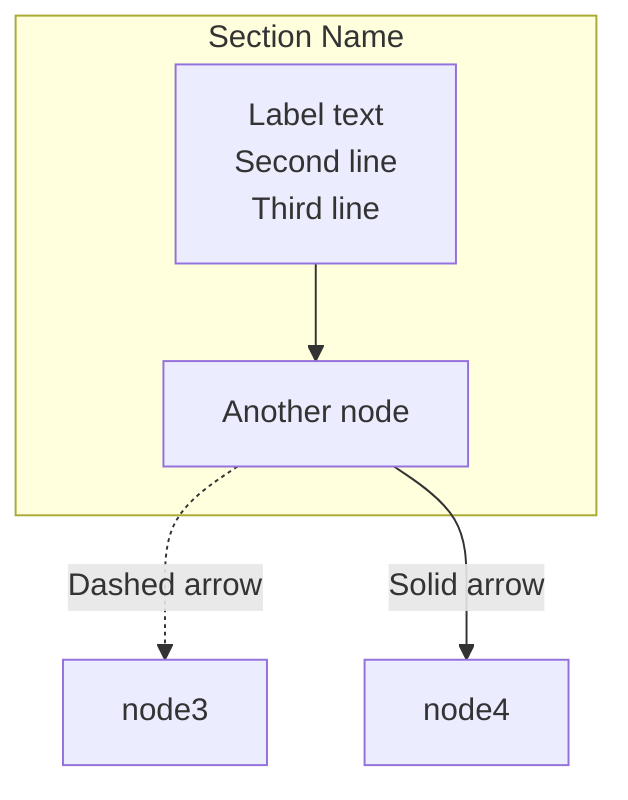

# Carbon ACX Architecture Documentation - v0.0.3

**Generated:** 2025-10-28
**Purpose:** Comprehensive Mermaid diagram documentation to inform human developer partners on all aspects of the Carbon ACX codebase.

---

## Contents

This directory contains 6 comprehensive Mermaid diagrams documenting the entire Carbon ACX architecture:

1. **[repo-structure.mermaid.md](./repo-structure.mermaid.md)** - Complete directory tree visualization
2. **[architecture-overview.mermaid.md](./architecture-overview.mermaid.md)** - High-level system design
3. **[component-map.mermaid.md](./component-map.mermaid.md)** - Detailed component breakdown
4. **[data-flow.mermaid.md](./data-flow.mermaid.md)** - How data moves through the system
5. **[entry-points.mermaid.md](./entry-points.mermaid.md)** - All ways to interact with the codebase
6. **[deployment-infrastructure.mermaid.md](./deployment-infrastructure.mermaid.md)** - How the code runs in production

---

## How to Use

### Viewing in GitHub
All `.mermaid.md` files render automatically in GitHub's web interface:
- Click any file above to see the diagram
- GitHub natively renders Mermaid syntax
- Diagrams are interactive (hover, zoom)

### Viewing in VS Code
Install the **Markdown Preview Mermaid Support** extension:
```bash
code --install-extension bierner.markdown-mermaid
```

Then open any `.mermaid.md` file and use the preview pane (Cmd+Shift+V).

### Viewing in Mermaid Live
Each file contains pure Mermaid syntax and can be pasted directly into [mermaid.live](https://mermaid.live):
1. Open the file
2. Copy the entire contents
3. Paste into mermaid.live editor
4. No modifications needed - works immediately

### Editing Diagrams
The `.mermaid.md` files use pure Mermaid syntax with these conventions:
- `%%` comment lines at the top provide context
- Blank line separates comments from diagram type
- All diagrams use detailed node labels with `<br/>` for multi-line text
- Subgraphs organize related components

---

## Diagram Quick Reference

### 1. Repository Structure
**Use when:** New to the codebase, looking for specific files
**Shows:** Directory organization, configuration files, code locations
**Key sections:**
- Data layer (CSV sources)
- Derivation engine (Python)
- User interfaces (3 apps)
- Edge delivery (Cloudflare)
- CI/CD tooling

### 2. Architecture Overview
**Use when:** Understanding system design, tech stack decisions
**Shows:** Architectural layers, external integrations, build pipeline
**Key sections:**
- Data flow from CSV → artifacts → UIs
- State management (Zustand, XState, TanStack Query)
- Visualization libraries (ECharts, Three.js, Recharts)
- Design system (CSS custom properties, component tiers)

### 3. Component Map
**Use when:** Understanding module boundaries, dependencies
**Shows:** All React components, Python modules, API layers
**Key sections:**
- Modern web app structure (apps/carbon-acx-web)
- Component tiers (Primitives → Layout → Viz → Domain)
- Dash analytics components
- Derivation engine modules

### 4. Data Flow
**Use when:** Tracing how data transforms through the system
**Shows:** Sequence diagrams for 3 user flows + manifest structure
**Key flows:**
- Calculator flow (form → breakdown → 3D viz)
- Explore flow (API → activities → timeline/3D)
- Insights flow (activities → charts → CSV export)
- Worker API (on-demand calculation)

### 5. Entry Points
**Use when:** Starting development, running builds, deploying
**Shows:** CLI commands, API endpoints, UI routes, build automation
**Key sections:**
- Python CLI (`make build`, `python -m calc.derive`)
- Development servers (Dash, Vite, Wrangler)
- Testing entry points (pytest, Vitest, Playwright)
- CI/CD triggers (GitHub Actions)

### 6. Deployment Infrastructure
**Use when:** Understanding production environment, troubleshooting deploys
**Shows:** Cloudflare Pages, Workers, CDN, deployment pipeline
**Key sections:**
- Developer → GitHub → Cloudflare flow
- CDN cache strategy
- Pages Functions (artifact proxy)
- Worker API (edge compute)
- Rollback strategy

---

## Changes from Previous Versions

### v0.0.3 (2025-10-28)
- **Added:** DataUniverse 3D visualization details (Three.js 0.168, React Three Fiber 8.17)
- **Added:** Calculator → 3D universe data flow (breakdown transformation)
- **Added:** Empty state handling and data surfacing bug fixes
- **Added:** Deployment infrastructure diagram (new)
- **Updated:** Component map with Tier 1-4 architecture
- **Updated:** State management (Zustand + XState + TanStack Query)
- **Updated:** Build pipeline with export-data.ts prebuild step

### v0.0.2 (Previous)
- Initial comprehensive documentation
- Covered basic architecture and data flow

### v0.0.1 (Earliest)
- Preliminary diagrams

---

## Contributing

When updating these diagrams:

1. **Test in mermaid.live** first to validate syntax
2. **Keep node labels detailed** - use `<br/>` for multi-line descriptions
3. **Use subgraphs extensively** to organize related components
4. **Update this README** if adding new diagram types
5. **Version diagrams** - create new v0.0.X directory for breaking changes

---

## Mermaid Syntax Reference

Quick tips for editing:



**Common diagram types:**
- `graph TB` or `graph LR` - Flowcharts (top-bottom or left-right)
- `sequenceDiagram` - Timeline/interaction diagrams
- `classDiagram` - Component relationships
- `erDiagram` - Database schemas

---

## Questions?

For questions about the architecture or these diagrams:
1. Check the relevant diagram first
2. Review the codebase documentation in `/docs/`
3. Open a GitHub issue with `[Architecture]` prefix

---

**Maintained by:** Claude Code agents
**Last Updated:** 2025-10-28
**Related Docs:** `/docs/acx/ACX080.md` (Phase 1 rebuild), `/docs/guides/` (how-to guides)
